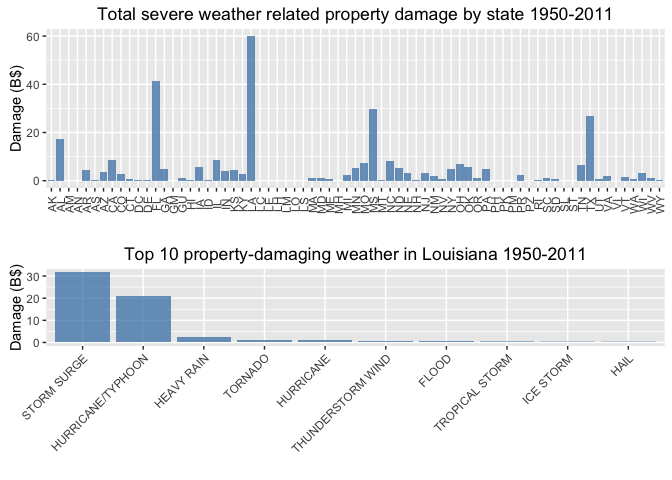

# Analysis of public health and economic consequences of severe weather events
Wei Wei  
April 22, 2016  


## Synopsis

Storms and other severe weather events can cause both public health and economic problems for communities and municipalities. Many severe events can result in fatalities, injuries, and property damage, and preventing such outcomes to the extent possible is a key concern.

This project involves exploring the U.S. National Oceanic and Atmospheric Administration's [(NOAA) storm database][1]. This database tracks characteristics of major storms and weather events in the United States, including when and where they occur, as well as estimates of any fatalities, injuries, and property damage.

The following data analysis shows that tornado is the most harmful severe weather event in the US. Tornados both killed and injured more people than any other severe weather types from 1950 to 2011. Furthermore, it is found that from 1950 to 2011 severe weather related fatality spiked in 1995. The states of Illinois and Texas had the most fatality compared to other states.

Analysis also shows that flood and drought caused the most damages on property and crops, respectively. California is the victim of most property damage among the states, with flood as the leading cause; Texas is the victim of most crops damage, with drought as the leading cause.

[1]: https://d396qusza40orc.cloudfront.net/repdata%2Fdata%2FStormData.csv.bz2 "(NOAA) storm database"

## Data Processing

NOAA storm data was downloaded from the given url and read into Rstudio using the read.csv() function. The data table contains 902297 observations of 10 variables, with 985 severe weather types. Fatality and injury numbers are in FATALITIES and INJURIES variables respectively. Property damage is split into 2 variables: PROPDMG, which contains the numeric value, and PROPDMGEXP, which contains the encoded units as "B", "h", "H", "K", "m", "M" etc. Similarly, crops damage is split into 2 variables: CROPDMG, which contains the numeric value, and CROPDMGEXP, which contains the encoded units as "B", "k", "K", "m", "M" etc. According to the associated [NOAA storm data FAQ][2], "B" or "b" encodes billions, "M" or "m" encodes millions, "K" or "k" encodes kilos, "H" or "h" encodes hundreds.

Original data is processed by extracting the event year information and selecting only the variables necessary for downstream analysis. Additional data processing are carried out before generating each figures, see below.

[2]: https://d396qusza40orc.cloudfront.net/repdata%2Fpeer2_doc%2Fpd01016005curr.pdf "NOAA storm data FAQ"


```r
## download files
rm(list=ls())

dataFileUrl <- 'https://d396qusza40orc.cloudfront.net/repdata%2Fdata%2FStormData.csv.bz2'
codeBookUrl <- 'https://d396qusza40orc.cloudfront.net/repdata%2Fpeer2_doc%2Fpd01016005curr.pdf'

if (!dir.exists('../webData')) {dir.create('../webData')}
if (!file.exists('../webData/NOAAStorm.csv.bz2')) 
    {download.file(dataFileUrl, destfile='../webData/NOAAStorm.csv.bz2', method='curl')}
if (!file.exists('../webData/NOAAStormCodeBook.pdf')) 
      {download.file(codeBookUrl, destfile='../webData/NOAAStormCodeBook.pdf', method='curl')}

## read the storm data file and assess the data
data <- read.csv('../webData/NOAAStorm.csv.bz2')

## transform the data by adding a year column and extracting data necessary for downstream analysis

suppressPackageStartupMessages(library(dplyr))
suppressPackageStartupMessages(library(lubridate))

data$year <- year(mdy_hms(data$BGN_DATE))
data <- data %>% select(year, STATE, EVTYPE, F, FATALITIES, INJURIES, PROPDMG, PROPDMGEXP, CROPDMG, CROPDMGEXP)
```

## Results

### 1. Across the United States, which types of events (as indicated in the EVTYPE variable) are most harmful with respect to population health?

Data processing for this figure 1 (1 plot): the fatality and injury values are grouped by the weather types, and the total number of fatality or injury for each weather types are derived as Fatality or Injury. A new variable, Casualty, combines the values of Fatality and Injury and is ranked.


```r
## the top 10 fatality+injury EVTYPE
library(dplyr)
casualty <- data %>% filter(FATALITIES != 0 | INJURIES != 0) %>% group_by(EVTYPE) %>% summarize(Fatality=sum(FATALITIES), Injury=sum(INJURIES)) %>% mutate(Casualty=Fatality + Injury) %>% arrange(desc(Casualty)) %>% top_n(10, Casualty)

## plotting using the ggplot2 plot system
suppressPackageStartupMessages(library(reshape2))

casualtyTemp <- melt(select(casualty, -Casualty), id.vars='EVTYPE')
casualtyTemp$EVTYPE <- factor(as.character(casualtyTemp$EVTYPE), levels=unique(casualtyTemp$EVTYPE))

suppressPackageStartupMessages(library(ggplot2))

g <- ggplot(casualtyTemp, aes(EVTYPE, value, fill=variable))
g <- g + geom_bar(stat='identity', alpha=0.75, position='stack')
g <- g + labs(x='', fill='', y='Total casualty 1950-2011', title='Top 10 most harmful severe weather types in the US')
g <- g + theme(axis.text.x=element_text(angle = 45, vjust = 1, hjust=1))

print(g)
```


##### Figure 1 conclusion: Tornados killed and injured the most people in the US from 1950 to 2011.


### 2. Across the United States, which types of events have the greatest economic consequences?

Data processing for figure 2 (2 plots): Property damage and crops damage, in billion dollars, are derived by converting the numeric values in the PROPDMG or CROPDMG variables with the information of the units in the PROPDMGEXP or CROPDMGEXP variables. Since it is anticipated that severe weather types may have different consequences on property and on crops, property damage and crops damage are derived and ranked separately. Damages are grouped by severe weather types and total damages are derived for each weather types, and are ranked.


```r
## tidy economic damage data on property and crops, in units billion dollars.

damage <- data %>% mutate(propDmgSum = ifelse(PROPDMGEXP %in% c("B", "b"), PROPDMG * 1, ifelse(PROPDMGEXP %in% c("M", "m"), PROPDMG * 1e-3, ifelse(PROPDMGEXP %in% c("K", "k"), PROPDMG * 1e-6, ifelse(PROPDMGEXP %in% c("H", "h"), PROPDMG * 1e-7, 0))))) %>% mutate(cropsDmgSum = ifelse(CROPDMGEXP %in% c("B", "b"), CROPDMG * 1, ifelse(CROPDMGEXP %in% c("M", "m"), CROPDMG * 1e-3, ifelse(CROPDMGEXP %in% c("K", "k"), CROPDMG * 1e-6, ifelse(CROPDMGEXP %in% c("H", "h"), CROPDMG * 1e-7, 0)))))

property <- damage %>% group_by(EVTYPE) %>% summarize(Property=sum(propDmgSum)) %>% arrange(desc(Property)) %>% top_n(10, Property)

crops <- damage %>% group_by(EVTYPE) %>% summarize(Crops=sum(cropsDmgSum)) %>% arrange(desc(Crops)) %>% top_n(10, Crops)

## plotting using the ggplot2 plot system

suppressPackageStartupMessages(library(gridExtra))

property$EVTYPE <- factor(as.character(property$EVTYPE), levels=unique(property$EVTYPE))
crops$EVTYPE <- factor(as.character(crops$EVTYPE), levels=unique(crops$EVTYPE))

g1 <- ggplot(property, aes(EVTYPE, Property))
g1 <- g1 + geom_bar(stat='identity', alpha=0.75, fill="coral")
g1 <- g1 + labs(x='', fill='', y='Total damage 1950-2011 (Billion Dollars)', title='Top 10 property-damaging weather')
g1 <- g1 + theme(axis.text.x=element_text(angle = 45, vjust = 1, hjust=1))

g2 <- ggplot(crops, aes(EVTYPE, Crops))
g2 <- g2 + geom_bar(stat='identity', alpha=0.75, fill="yellowgreen")
g2 <- g2 + labs(x='', fill='', y='', title='Top 10 crops-damaging weather')
g2 <- g2 + theme(axis.text.x=element_text(angle = 45, vjust = 1, hjust=1))

grid.arrange(g1, g2, ncol=2)
```


##### Figure 2 conclusion: Flood caused the most property damage, while drought caused the most crops damage in the US from 1950 to 2011.


### 3. In which years from 1950 to 2011 did severe weather events have the most harmful overall public health consequences? Which states had the most fatality caused by severe weather events?

Data processing for figure 3 (2 plots): To analyze total fatality per year, data is grouped by the extracted year variable and the total fatality for each year is derived. To analyze total fatality for each state, data is grouped by the STATE variable and the total fatality for each state is derived.


```r
## analysis casualty by year and state

fatalityYear <- data %>% group_by(year) %>% summarize(Fatality=sum(FATALITIES)) %>% arrange(year)

fatalityState <- data %>% group_by(STATE) %>% summarize(Fatality=sum(FATALITIES)) %>% arrange(STATE)

## plotting using the ggplot2 plot system

g31 <- ggplot(fatalityYear, aes(year, Fatality))
g31 <- g31 + geom_line(col='red')
g31 <- g31 + labs(x='', y='Fatality', title='Total severe weather related fatality by year from 1950 to 2011')
g31 <- g31 + scale_x_continuous(breaks = seq(1950, 2010, by = 5))

g32 <- ggplot(filter(fatalityState, STATE != 'XX'), aes(STATE, Fatality))
g32 <- g32 + geom_bar(stat='identity', alpha=0.75, fill="coral")
g32 <- g32 + labs(x='', fill='', y='Fatality', title='Total severe weather related fatality by state 1950-2011')
g32 <- g32 + theme(axis.text.x=element_text(angle = 90, vjust=0.6))
      
grid.arrange(g31, g32, ncol=1)
```


##### Figure 3 conclusion: From 1950 to 2011 severe weather related fatality spiked in 1995 in the US. The state of Illinois had the most fatality compared to other states, followed by Texas. 


### 4. In which states did severe weather events have the greatest overall economic consequences, and what are the repective dominant damaging severe weather types?

Data processing for figure 4 (4 plots): To analyze property or crops damage for each state, data is grouped by the STATE variable and the total property damage or crops damage for each state is derived.


```r
## analysis damage (property, crops) by state

propertyState <- damage %>% group_by(STATE) %>% summarize(Property=sum(propDmgSum)) %>% arrange(STATE)

CAProperty <- damage %>% filter(STATE=='CA') %>% group_by(EVTYPE) %>% summarize(Property=sum(propDmgSum)) %>% arrange(desc(Property)) %>% top_n(10, Property)

CAProperty$EVTYPE <- factor(as.character(CAProperty$EVTYPE), levels=unique(CAProperty$EVTYPE))

cropsState <- damage %>% group_by(STATE) %>% summarize(Crops=sum(cropsDmgSum)) %>% arrange(STATE)

TXCrops <- damage %>% filter(STATE=='TX') %>% group_by(EVTYPE) %>% summarize(Crops=sum(cropsDmgSum)) %>% arrange(desc(Crops)) %>% top_n(10, Crops)

TXCrops$EVTYPE <- factor(as.character(TXCrops$EVTYPE), levels=unique(TXCrops$EVTYPE))

## plotting using the ggplot2 plot system

g41 <- ggplot(filter(propertyState, STATE != 'XX'), aes(STATE, Property))
g41 <- g41 + geom_bar(stat='identity', alpha=0.75, fill="steelblue")
g41 <- g41 + labs(x='', fill='', y='Damage (B$)', title='Total severe weather related property damage by state 1950-2011')
g41 <- g41 + theme(axis.text.x=element_text(angle = 90, vjust=0.6))

g42 <- ggplot(CAProperty, aes(EVTYPE, Property))
g42 <- g42 + geom_bar(stat='identity', alpha=0.75, fill="steelblue")
g42 <- g42 + labs(x='', fill='', y='Damage (B$)', title='Top 10 property-damaging weather in CA 1950-2011')
g42 <- g42 + theme(axis.text.x=element_text(angle = 45, vjust = 1, hjust=1))

grid.arrange(g41, g42, ncol=1)
```



```r
g43 <- ggplot(filter(cropsState, STATE != 'XX'), aes(STATE, Crops))
g43 <- g43 + geom_bar(stat='identity', alpha=0.75, fill="yellowgreen")
g43 <- g43 + labs(x='', fill='', y='Damage (B$)', title='Total severe weather related crops damage by state 1950-2011')
g43 <- g43 + theme(axis.text.x=element_text(angle = 90, vjust=0.6))

g44 <- ggplot(TXCrops, aes(EVTYPE, Crops))
g44 <- g44 + geom_bar(stat='identity', alpha=0.75, fill="yellowgreen")
g44 <- g44 + labs(x='', fill='', y='Damage (B$)', title='Top 10 crops-damaging weather in TX 1950-2011')
g44 <- g44 + theme(axis.text.x=element_text(angle = 45, vjust = 1, hjust=1))

grid.arrange(g43, g44, ncol=1)
```


##### Figure 4 conclusion: From 1950 to 2011, California suffered the most property damage, at 124 Billion dollars, with flood causing the most damage; while Texas suffered the most crops damage, at 7.3 Billion dollars, with drought causing the most damage.


## Discussions

Local, state, and federal governments should improve counter-measures to reduce tornado-related fatalities and injuries, flood-related property damage, and drought-related crops damage. 

Illinois is shown to be the state, and 1995 is shown to be the year with the most weather related fatality. These 2 results correlate well with one recorded major severe weather event in the US: the 1995 heat wave in Chicago, Illinois that killed hundreds of people.

California should strive to reduce flood-related property damage; while Texas should strive to reduce drought-related crops damage.


